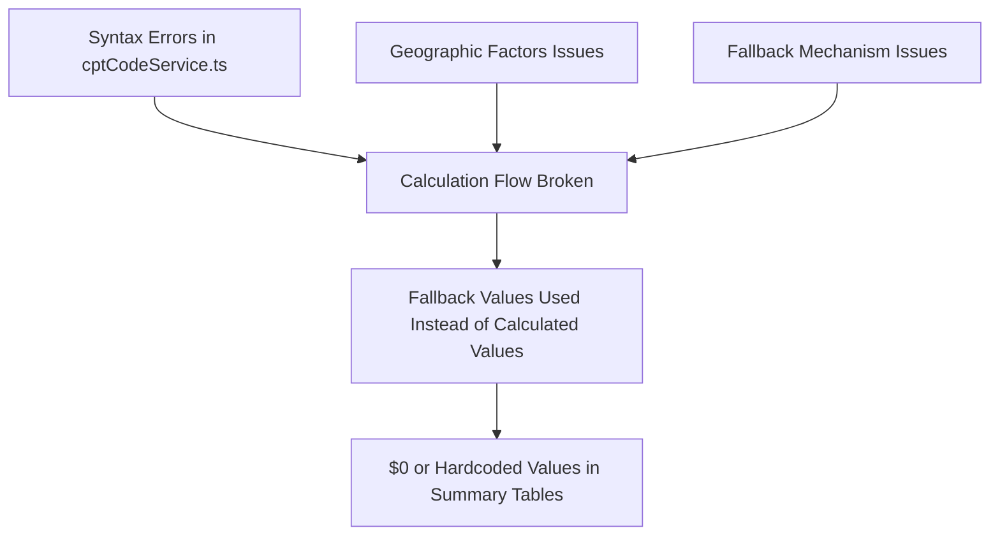
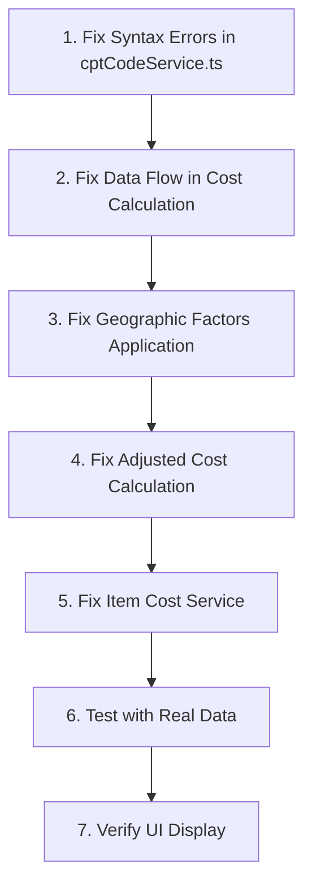

# Cost Calculation Fix Plan

## Issue Summary

The application is not correctly calculating costs and is showing $0 or using hardcoded fallback values in the summary tables after costs are entered and confirmed. The key issues are:

1. The fix-cost-calculation.mjs script introduced syntax errors in the cptCodeService.ts file
2. The cost calculation flow is broken, even though the CPT code lookup appears to be working correctly
3. The fallback mechanisms are being triggered instead of using the actual calculated values

## Root Causes Analysis

1. **Syntax Errors**: The fix-cost-calculation.mjs script introduced syntax errors in the cptCodeService.ts file, breaking parts of the calculation flow.

2. **Calculation Flow Issues**: Even though the CPT code lookup appears to be working, the data isn't being properly passed through the calculation pipeline.

3. **Fallback Mechanism Issues**: The fallback mechanisms are being triggered too frequently, causing the system to use hardcoded values instead of properly calculated values.

## Detailed Fix Plan

### 1. Fix Syntax Errors in cptCodeService.ts

The first step is to fix the syntax errors in the cptCodeService.ts file that were introduced by the fix-cost-calculation.mjs script:

- Manually inspect the cptCodeService.ts file for syntax errors
- Fix duplicate code blocks and nested return statements
- Ensure proper code structure and indentation
- Remove any redundant code blocks
- Verify that the file compiles without errors

### 2. Fix Data Flow in Cost Calculation

The data flow in the cost calculation pipeline needs to be fixed to ensure data is properly passed between services:

- Trace the data flow from CPT code lookup to final cost calculation
- Identify where the data is being lost or transformed incorrectly
- Fix the data transformation and passing between services
- Add logging at each step to verify data is being passed correctly

### 3. Fix Geographic Factors Application

The geographic factors application needs to be fixed to ensure it correctly applies adjustment factors:

- Verify that geographic factors are being correctly retrieved from the database
- Ensure the applyGeoFactors function correctly applies factors to MFU and PFR costs
- Add validation to ensure factors are always valid numbers (not NaN)
- Implement proper fallback values only when factors cannot be retrieved

### 4. Fix Adjusted Cost Calculation

The adjusted cost calculation needs to be fixed to ensure it correctly calculates cost ranges:

- Fix the calculateAdjustedCosts function to properly combine MFU and PFR data
- Ensure the cost range (low, average, high) never contains zero or NaN values
- Implement proper fallback values only when calculations fail
- Add validation to ensure all calculated values are reasonable

### 5. Fix Item Cost Service

The item cost service needs to be fixed to ensure it correctly calculates annual and lifetime costs:

- Fix the calculateItemCosts function to properly use the adjusted costs
- Ensure the frequency and duration are correctly applied to calculate annual and lifetime costs
- Implement proper fallback values only when calculations fail
- Add validation to ensure all calculated values are reasonable

### 6. Test with Real Data

After fixing the services, we need to test the calculations with real data:

- Create test cases with real CPT codes and ZIP codes
- Verify that the calculations produce expected results
- Check that fallback mechanisms work correctly when data is missing
- Ensure that the calculations never produce zero or NaN values

### 7. Verify UI Display

Finally, we need to verify that the calculated costs are correctly displayed in the UI:

- Check that the cost range is displayed correctly in the item table
- Verify that the annual costs are calculated and displayed correctly
- Ensure that the lifetime costs are calculated and displayed correctly
- Check that the category totals and grand total are calculated correctly

## Implementation Strategy

Since the fix-cost-calculation.mjs script didn't work correctly, we'll need to take a more manual approach:

1. **Manual Code Fixes**: We'll manually fix the syntax errors in the cptCodeService.ts file and other affected files.

2. **Incremental Testing**: After each fix, we'll test the affected functionality to ensure it works correctly.

3. **Logging Enhancement**: We'll add more detailed logging to help diagnose issues in the calculation flow.

4. **Fallback Mechanism Improvement**: We'll improve the fallback mechanisms to ensure they provide reasonable values when calculations fail, but are not triggered unnecessarily.

5. **End-to-End Testing**: We'll test the entire calculation flow with real data to ensure it works correctly.

## Potential Challenges and Mitigations

1. **Complex Calculation Flow**: The calculation flow involves multiple services and components, making it difficult to track down issues.
   - Mitigation: Add detailed logging at each step of the calculation flow to help diagnose issues.

2. **Database Connectivity**: Issues with database connectivity could cause the CPT code lookup to fail.
   - Mitigation: Improve error handling and fallback mechanisms to handle database connectivity issues.

3. **Edge Cases**: There are many edge cases to handle (null values, undefined values, NaN values, zero values).
   - Mitigation: Add comprehensive validation and fallback mechanisms to handle all edge cases.

4. **UI Integration**: The UI components need to correctly use the calculated values from the services.
   - Mitigation: Add validation in the UI components to ensure they handle all possible values correctly.